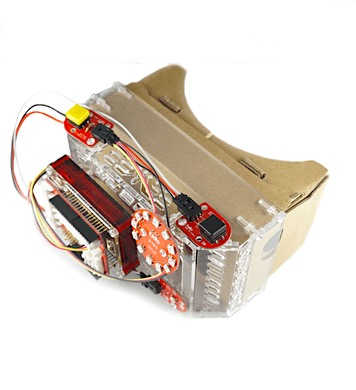

# #1401 Cardboard Plus Kit

<!--COLORME-->

注文を受けてから生産しますので、納期にお時間をいただく場合があります。

## Overview
Cardboard Plusは、Cardboardの拡張キットです。

**このキットにはArduinoやBrickは含まれませんのでご注意下さい。**

**デザインは予告なく変更される場合があります。**

**マニュアルで使われている写真のパーツと、実際のパーツの色や形が異なる場合があります。あらかじめご了承ください。**

## パーツ構成

使用ネジはM3-18プラネジ12本です。

## 組み立て方法

** ※簡易イラストです。実物はパーツを合わせる為のデコボコとブリック等を取り付ける為の穴があります。**

### 1.(6)と(7)を(1)と(2)で挟みます。

ミゾにはめ込みます。方向に注意してください。

### 2.(1)と(2)の正面に(3)をネジで取り付けます。

十字にくりぬかれている部分にネジとナットを取り付けて固定します。

方向に注意してください。

### 3.(1)と(2)の側面に(4)と(5)をネジで取り付けます。

### 4.組み立てたカードボードを差し込んで完成です。

資料

適合するカードボードのサイズは以下のサイズです。

