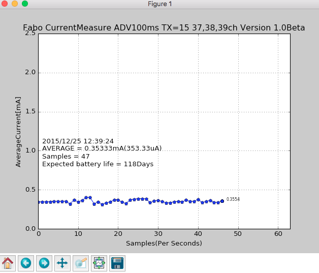
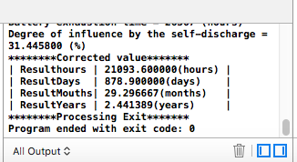

# #2001 Current Measure Brick Edition


ハードウェア開発中

基本原理は、ビーコン（負荷）に抵抗の小さい抵抗を直列に接続して、その抵抗の電位差が解れば電流値がわかることを利用しています。（i=v/R）

## Connecting
I2Cコネクタへ接続します。

## Support
| <center>Arduino | <center>RaspberryPI | <center>IchigoJam |
| -- | -- |
| <center>○ | <center>×| <center>× |

## Registor
| Slave Address |
| -- |
| 0x40|

## Datasheet
| Document |
| -- |
||

## Schematic

##ビーコンの電流計測方法
## Sample Code
### Arduino
電流計測はADV100msで行ってください。

```c
//#2001CurrentMeasureBrickEdition
//Fabo Inc. 2015

#include <Wire.h>
//INA226のレジスターセット
#define ADDRESS  B1000000  //HEX 0x40（INA226のアドレス）
#define CONFIG   B0000000  //HEX 0x00
#define SHUNTV   B0000001  //HEX 0x01
#define BUSV     B0000010  //HEX 0x02
#define POWER    B0000011  //HEX 0x03
#define CURRENT  B0000100  //HEX 0x04
#define CALIB    B0000101  //HEX 0x05
#define MASK     B0000110  //HEX 0x06
#define ALERT    B0000111  //HEX 0x07

//シリアルモニタ速度
#define Monitor 9600

//Battery Capacity CR2032 220mAh,{CR2477N 950mAh,CR2477 1000mAh}
//寿命予測する電池の容量を入力する。
#define BAT_Capacity 1000

//ビーコンのアドバタイズ間隔 100msでの場合
#define Adv_Interval 100

//テストID
#define TestID 0001

//測定値の補正する係数

const float miri = 0.001f;            
const float Hosei = 1.0f;

//パケットを100msで出した場合143.36msに少なくとも１回はビーコンからは発射されるので100msに補正する。
//140μsごとに連続的に計測し1024回の平均だと143.36msになる。この数値は当然ながら実際よりも低い数値になる。
//140μS * 1024times = 143.36ms 143.36 / 100 = 1.436 
const float Adj = 1.436f;

//シャント抵抗の補正 2.2Ω使用時
const float registoregit = 0.00113f;

//測定の設定　マスター(Arduino)からスレーブ(INA226)へデータを書き込み要求する関数
void Slave_write(byte regset, unsigned short regdata)
{
  //通信開始　指定するスレーブ(0x40)を指定する。
  Wire.beginTransmission(ADDRESS);
  //データをスレーブに書き込みをする。
  Wire.write(regset);
  //バイト単位なので、上位桁から8ビットを送るので
  Wire.write(regdata >> 8);
  //のこり下位８ビットを書き込み要求。
  Wire.write(regdata);
  //スレーブに通信終了の信号を送る。
  Wire.endTransmission();  
}

//測定結果　マスター(Arduino)からスレーブ(INA226)へデータ送信要求し、スレーブからのデータ受信する関数。
unsigned short Slave_read(byte regset)
{
  
  //**　マスターの送信
  short rd = 0;
  //通信開始　指定するスレーブ(0x40)を指定する。
  Wire.beginTransmission(ADDRESS);
  //設定データをスレーブ（0x40）に送る。
  Wire.write(regset);
  //スレーブに通信終了を信号を送る。
  Wire.endTransmission(); 
  
  //** マスターの受信
  // スレーブ(0x40)からの計測データを要求する。2は２バイト（１６ビット）
  Wire.requestFrom(ADDRESS, 2);
  //受信できたバイト数だけ繰り返す。
  while(Wire.available()) {
  //左に１バイト分シフト。（スレーブからくる測定データは上位桁数から読むので8ビット分シフトする）
    rd = rd * 256;
    //reauestFromから受信したデータを取り出し、下の桁の8ビットに代入する。
    rd += Wire.read();
  }
  return rd;
}
void setup() {
  //シリアルモニタに9600bpsで表示する。
  Serial.begin(Monitor);
  //I2C通信を初期化する。
  Wire.begin();
  //コンフィグレーション(0x00)で測定の設定をスレーブに要求し、次のデータ（コンフィンングレーションレジスタ）0B100111011011111は、最下位ビット111は、シャントとバスを連続で測るモード、
  //４から６ビット目011はシャントの測定時間140μ、7ビットから９ビット目011は、Fバス側の測定時間140μ、
  //１０から１２ビット目は、111は１０２４回計測しその平均を出す。
  Slave_write(CONFIG, 0B100111011011111);
  Slave_write(CALIB,  2048);
}

void loop() {
  //計測結果のid
  static unsigned int c_id;
  float bus_v,shunt_v,bus_v125,c; 
  //CSVのフィールド
  static boolean pre;
  //バス電圧データを求め、1ビットあたり1.25mVなので
  bus_v125 = Slave_read(BUSV) * miri * 1.25f;
  //シャント間の電圧を求める。シャント抵抗の１ビットあたり2.5μVであり平均を１００msに補正する。
  shunt_v = Slave_read(SHUNTV) * 0.000001 * 2.5f * Adj;
  //1mAを0.1mAに修正する
  c = (Slave_read(CURRENT) / Hosei) * Adj * registoregit;
  int cc;
  cc = (Slave_read(CURRENT) / Hosei);
  c_id++;
 
  
  Serial.println(c,4);
  
  delay(1000);
}

```

### Mac(python2.7.9)
計測されたサンプルの値をpythonでグラフ化します。Macはあらかじめ標準でPythonはインストールされていますが、実行に必要なモジュールをインストールしてください。

```python
# coding: utf-8
#CurrentMeasureGraph Beta Fabo 2015
#Version 1.0
#Python Version 2.7.9

from __future__ import unicode_literals, print_function

import numpy as np
import matplotlib.pyplot as plt
import pygame
from pygame.locals import *
import serial
import sys
import math
import time
import datetime
import locale


def pause_plot():
    # COMポート　Macは、/dev/tty.usbmodem****' windowsはCOM*
    ser = serial.Serial('/dev/tty.usbmodem1411')
    fig, ax = plt.subplots(1, 1)
    #バッテリーの設定 リチウム電池CR2477 1000mhA
    batteryCapacity = 1000
    #初期化
    x = []
    y = []
    z = []
    n = 63
    x = n * [0]
    y = n * [0]
    
    # グリッドを表示
    plt.grid(True)
    # 軸の設定する
    plt.xlim([0, 63])
    plt.ylim([0, 2.5])
    #軸の名前
    plt.xlabel("Samples(Per Seconds)")
    plt.ylabel("AverageCurrent[mA]")
    #グラフタイトル
    ax.set_title('Fabo CurrentMeasure ADV100ms TX=15 37,38,39ch Version 1.0Beta')
    lines, = ax.plot(x, y, color="b", marker="p")

    j = 0
    w = 0
    
    while True:
        #Arduinoからデータの取得
        d = float(ser.readline().rstrip())
        #平均を出すのにデータを蓄積する。
        z.append(d)
        
        date = datetime.datetime.today()
        
        #グラフの再描画
        if j == 63:
            j=0
            for c in range(63):
                x[c] = 0
            for c in range(63):
                y[c] = 0
        #グラフを消去する。
        for txt in ax.texts:
            txt.set_visible(False)
        
        y[j] = d
        #データの取得していない部分は最新ポイントへ移動
        for c in range(63 - j):
            x[j+c] = j
            y[j+c] = y[j]
        #テキストの表示
        h = ax.text(x[j]+1, y[j], d,color = 'k',size="7")
        ax.texts
        #日付の表示
        v = ax.text(1, 1.1, '%s/%s/%s %s:%s:%s' % (date.year, date.month, date.day,date.hour,date.minute,date.second) ,color = 'k',size="12")
        #平均の表示
        ave = sum(z) / (w+1)
        s = ax.text(1, 1, "AVERAGE = " + str(round(ave,5)) + "mA" + "(" + str(round(ave,5)*1000) + "uA" + ")",color = 'k',size="12")
        #サンプル数の表示
        r = ax.text(1, 0.9, "Samples = " + str(w+1),color = 'k',size="12")
        #リチウム電池寿命の表示
        b = ax.text(1, 0.8, "Expected battery life = " + str(int(round(batteryCapacity/ave/24))) + "Days",color = 'k',size="12")
        #CVS形式で表示
        if w == 1:
            print("Time,Sample,Currnt(mA)")
        print ('%s/%s/%s %s:%s:%s,' % (date.year, date.month, date.day,date.hour,date.minute,date.second) + str(w) + "," + str(d))

        j += 1
        w += 1
        
        lines.set_data(x, y)

        plt.pause(.01)

if __name__ == "__main__":
    pause_plot()
```
### Result
ADV100msで行った結果です。例えば300msでADVで行った場合の時間は単純に３倍となります。

### Xcode(C)
マンガン、アルカリ乾電池では自己放電が高いため、考慮しなくてはいけません。下のコードは自己放電率は５％としています。以下のコードは計算をわかりやすくするため、１秒間の消費電流はADV100ms時は0.35mAでしたので1000msは0.035mAとします。１秒間に何回電波を出すかをAdvertiseTimesとしています。C言語ですので多くの環境で実行できますが、Xcodeを想定しております。

```c
//
//  main.c
//  CurrentTImeEqution 1.0Beta
//
//
#include <stdio.h>
#include "main.h"

//条件を設定（アルカリ乾電池の自己放電率は5%,リチウム電池は1%）
#define BatteryVolum 4000
#define AvarageCurrent 0.035
#define AdvertiseTimes 10.0
#define SelfDischargeRate 0.95
#define Correctionfactor 0.8

int main(void){
    unsigned int t = 0;
    double RestCurretVolume = 0.0;
    static double h = 365.0*24.0;
    printf("********Processing Start******* \n");
    do{
        
        RestCurretVolume = BatteryVolum * pow( SelfDischargeRate, (t/h))-((AvarageCurrent*AdvertiseTimes)*t);
        printf("Remaining capacity:%fmAh Elapsed hour:%d(h)\n",RestCurretVolume,t);
        t++;
    }while(RestCurretVolume >= 0);
    //前の結果を取り出す。
    printf("************Result************\n");
    t = t - 2;
    
    //バッテリー切れ時間の表示。
    printf("Battery exhaustion time = %d (hours)\n",t);
    
    //8掛けして、マージンを考慮した結果。
    double Result = t * Correctionfactor;
    
    //自己放電の影響度を算出。
    double ImpactSelfDischargeRate = (1 - (Result / ((BatteryVolum / (AvarageCurrent * AdvertiseTimes)))))*100;
    printf("Degree of influence by the self-discharge = %f (%%)\n",ImpactSelfDischargeRate);
    
    //それぞれの単位で結果を表示。
    printf("********Corrected value******* \n");
    printf("| Resulthours | %f(hours)\t|\n",Result);
    printf("| ResultDays  | %f(days) \t|\n",Result/24);
    printf("| ResultMouths| %f(months) \t|\n",Result/24/30);
    printf("| ResultYears | %f(years) \t|\n",Result/24/30/12);
    printf("********Processing Exit*******\n");

    return 0;
}
```
## Result


## Parts

