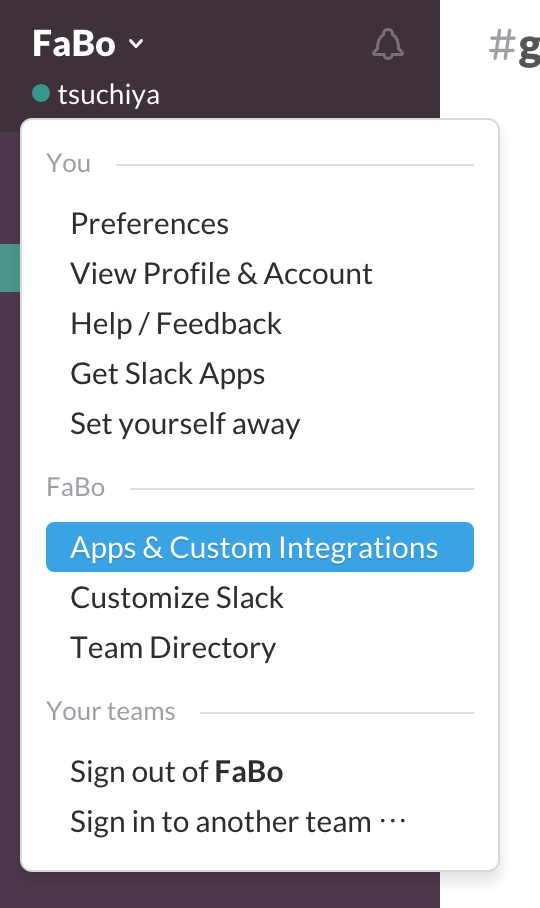
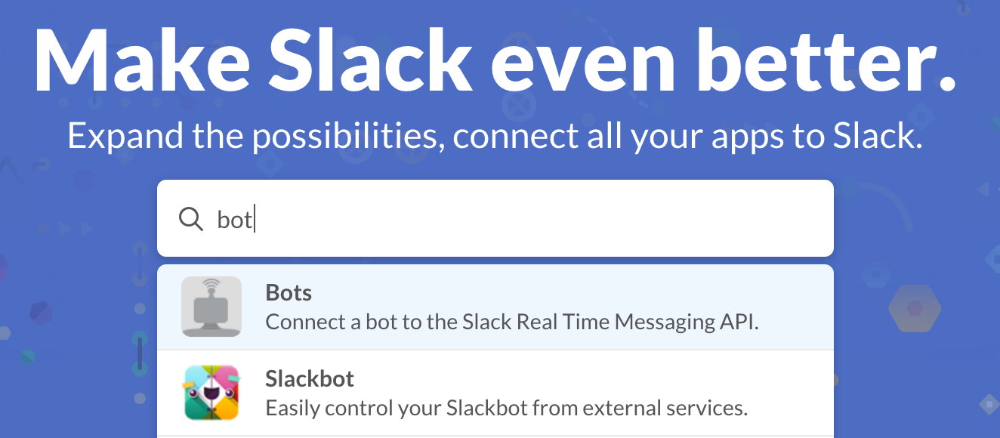
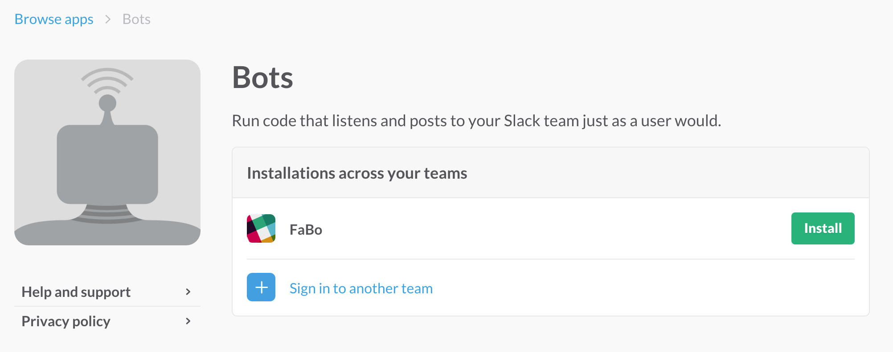
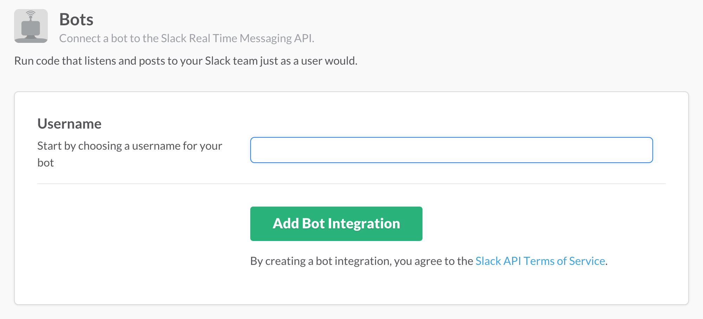
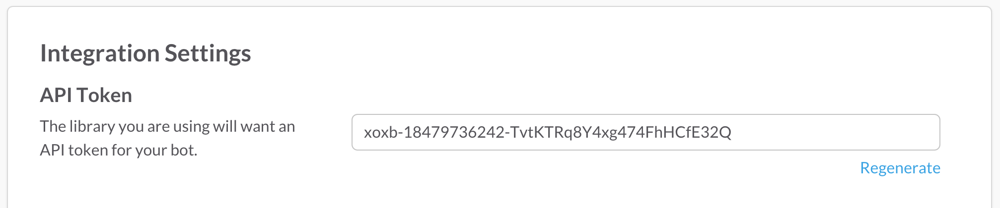

# Botkit

ボットを作成するためのフレームワーク。  
node.jsで動作する。

## インストール

```
npm init
npm install --save botkit
```

## BotUserの作成

1. 左のチーム名をクリックすると出てくるメニューから「Apps & Custom Integrations」を選択する。
 

2. Botsを探してクリックする。
 

3. Installボタンをクリックする。
 

4. Botの名前を入力する。
 

5. API Tokenを覚えておく。
 

