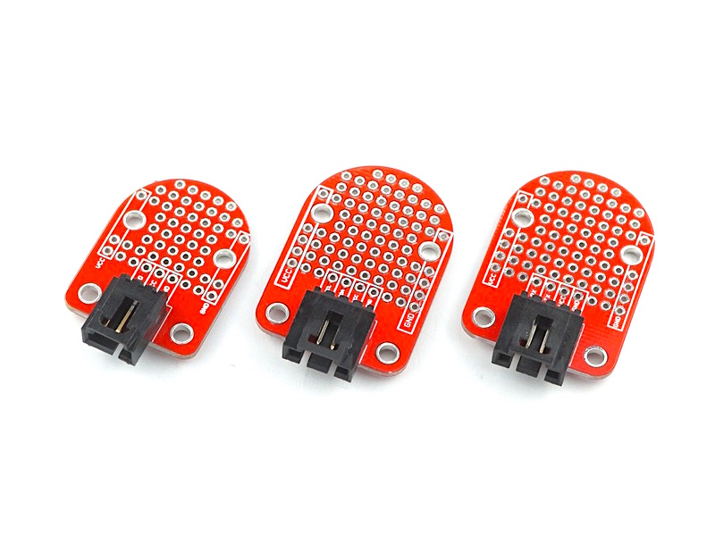
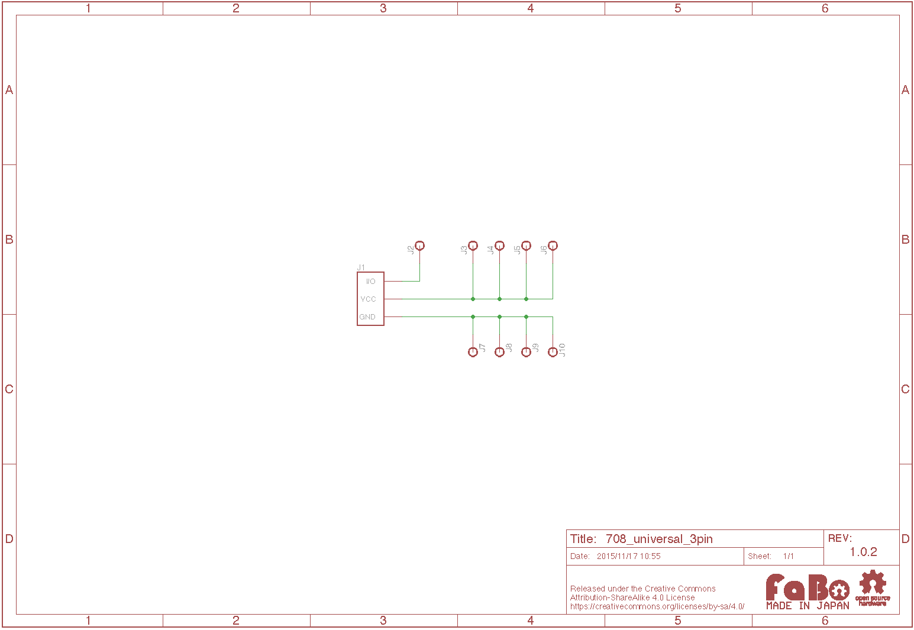

# #708-710 Universal Brick

<!--COLORME-->

## Overview
Universal Brickは、プロトタイピング用のBrickです。
部品を実装することでオリジナルのBrickを作成することができます。

## UniversalBrickの種類
UniversalBrickは、3pin、I2C、Serialの３種類のBrickがあります。

|ID|名称|
|--|--|
|#708|Universal 3pin|
|#709|Universal I2C|
|#710|Universal Serial|

## Support
|Arduino|RaspberryPI|IchigoJam|
|:--:|:--:|:--:|
|◯|◯|◯|

## Schematic

※Universal 3pinのものになります。
