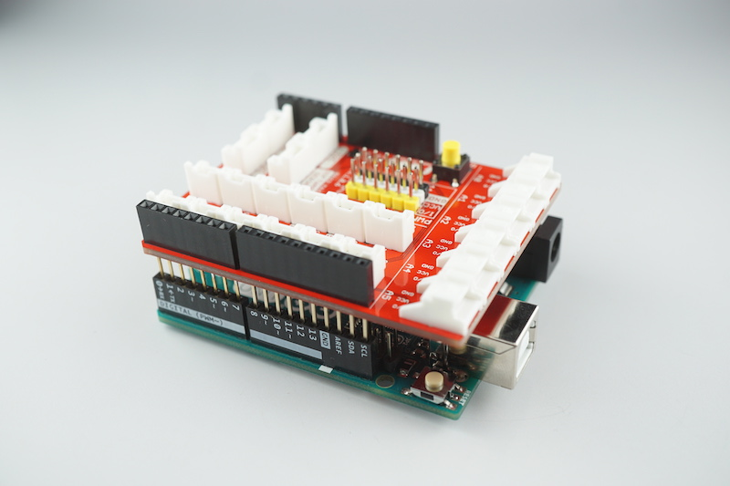
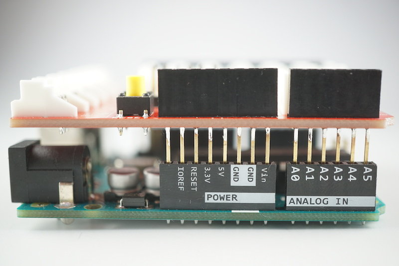
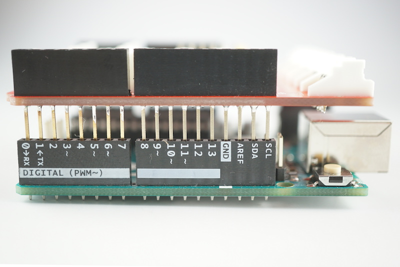
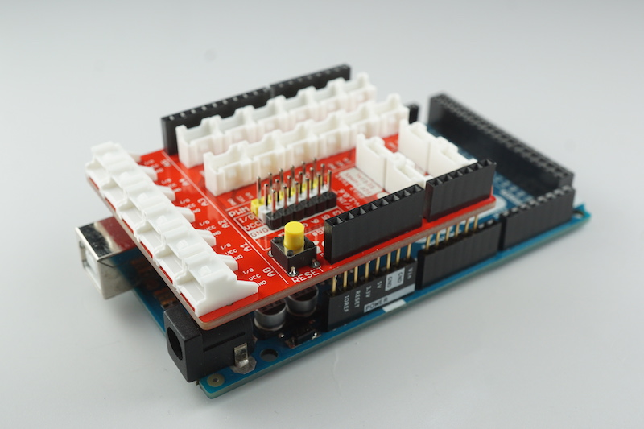
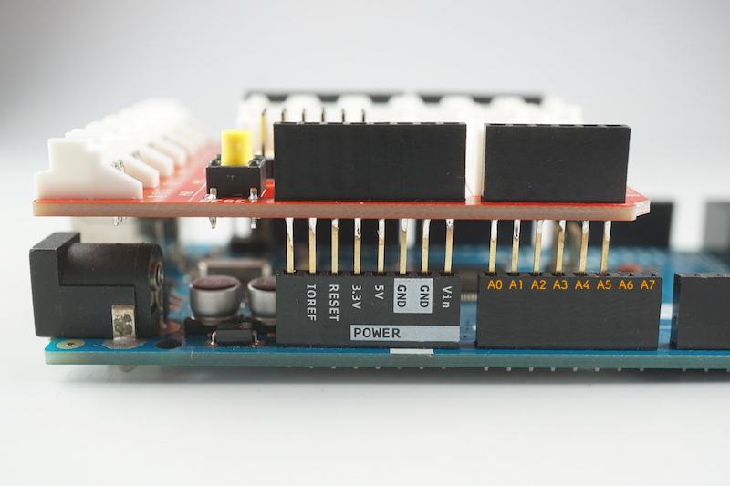

# Out/Inシールドの接続方法

##Arduino UNO

###装着時イメージ
Arduinoに対して下の写真の様な向きで接続します。

###電源コネクタが左側の状態
左端が予備ピン、右端がA5ピンに接続されます。

※R2以前のものは予備ピン、IOREFピンが存在しないため、２つは接続されない状態になります。

###電源コネクタが右側の状態
左端が0ピン、SCLピンに接続されます。

※R2以前のものはSDAピン、SCLピンが存在しないため、２つは接続されない状態になります。

また、上記のピンはI2C接続時に使用しているため、このバージョンでは、I2CのBrickはご利用頂けませんが、A4ピンとSDAピン、A5ピンとSCLピンのそれぞれのソケットをジャンパー線などで接続することで、I2CのBrickがご利用頂けるようになります。

##Arduino MEGA
###装着時イメージ
Arduinoに対して下の写真の様な向きで接続します。

###電源コネクタが左側の状態
左端が予備ピン、右端がA5ピンに接続されます。

※R2以前のものは予備ピン、IOREFピンが存在しないため、２つは接続されない状態になります。

###電源コネクタが右側の状態
左端が0ピン、SCLピンに接続されます。

※R2以前のものはSDAピン、SCLピンが存在しないため、２つは接続されない状態になります。

また、上記のピンはI2C接続時に使用しているため、このバージョンでは、I2CのBrickはご利用頂けませんが、ArduinoMEGAの20ピンとシールドのSDAピン、ArduinoMEGAの21ピンとシールドのSCLピンのそれぞれのソケットをジャンパー線などで接続することで、I2CのBrickがご利用頂けるようになります。