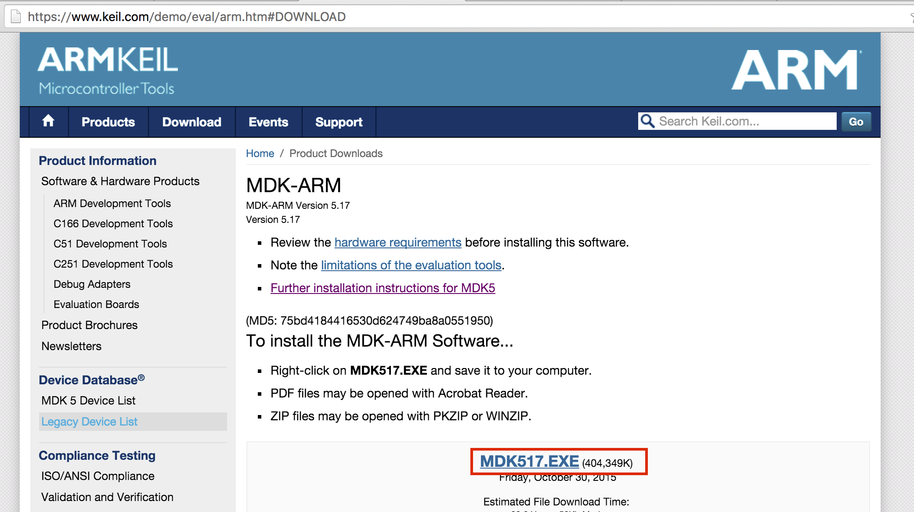
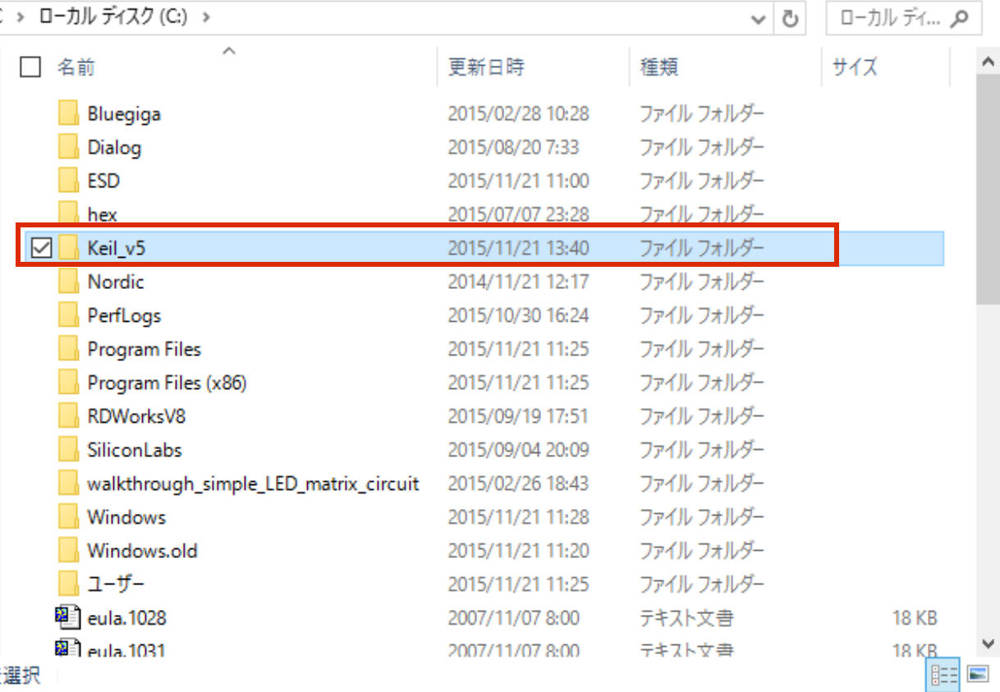
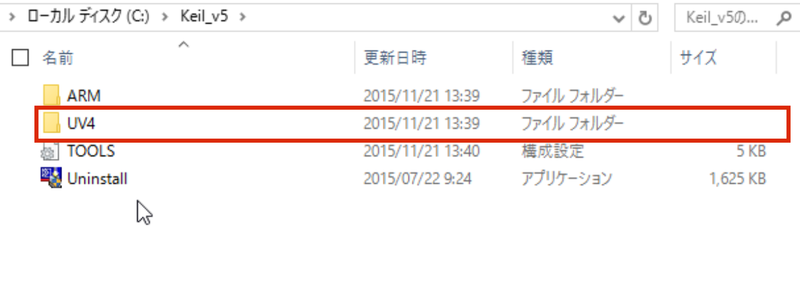
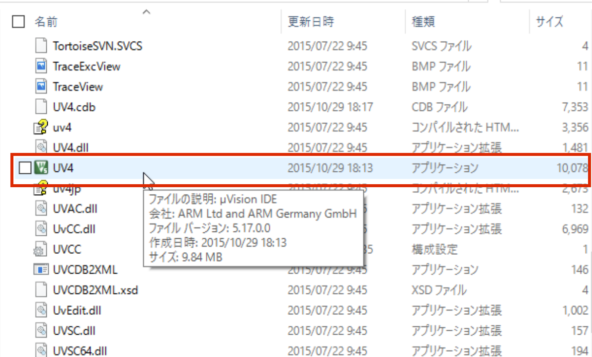
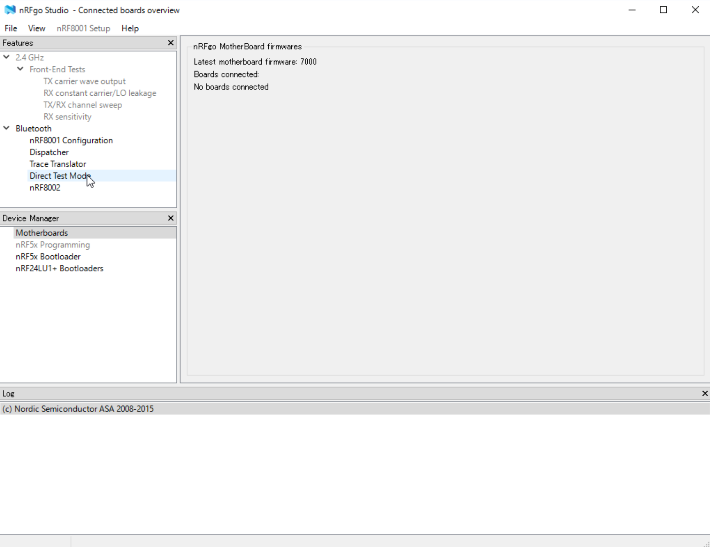
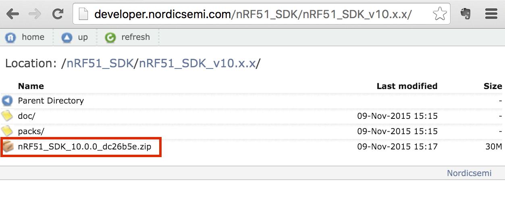
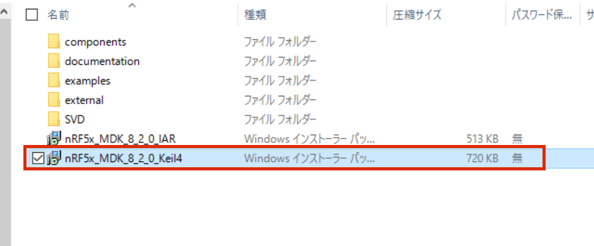
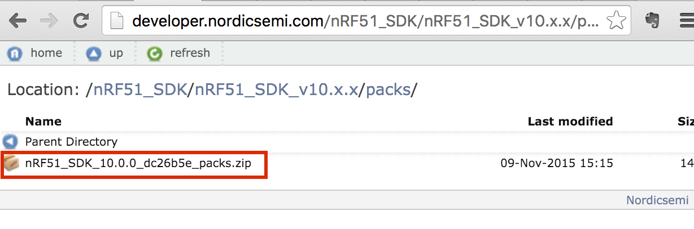
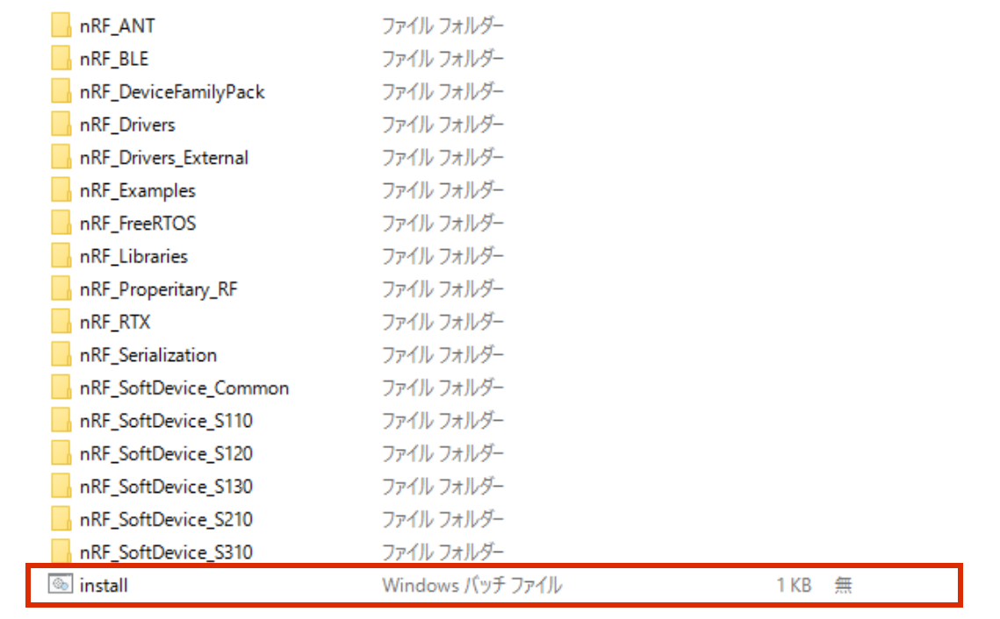

# KeilとSDKのインストール

https://www.keil.com/demo/eval/arm.htm

よりARM MDKをダウンロードし、インストールする。

 

実行

 

 

 

# nRFGO SDK

http://www.nordicsemi.com/eng/nordic/Products/nRFgo-SDK/nRFgo-SDK/13081

よりnRFGO SDKをダウンロードし、インストールする。

 

# nRF5x SDK

http://developer.nordicsemi.com/

nRF51の場合は、nRF51 SDK, nRF52の場合は、nRF52 SDKをインストール。

 

 

 

