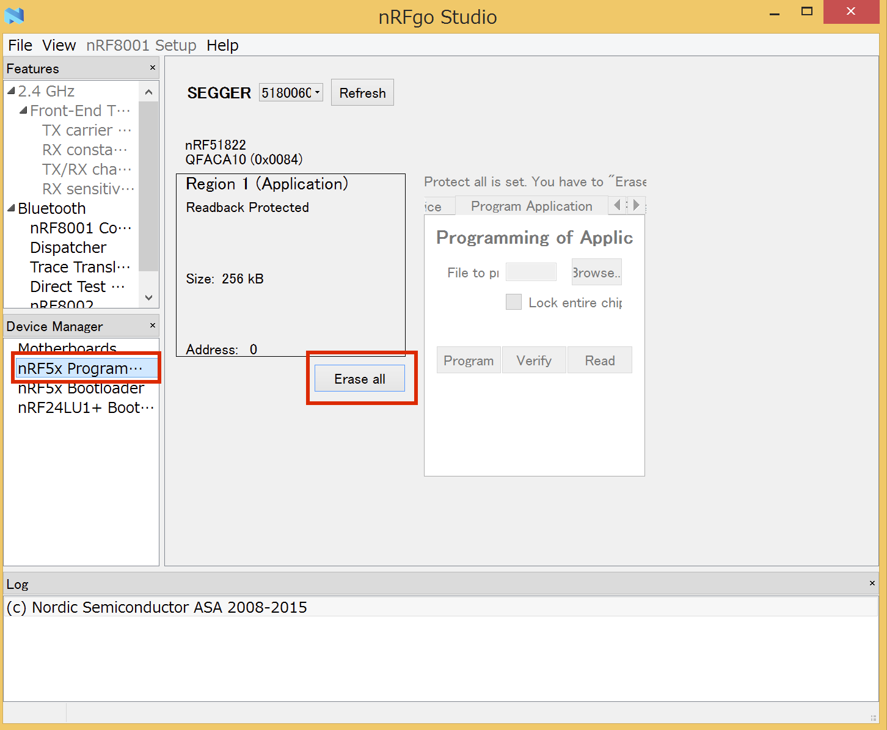

# SoftDeviceの焼き込み

## ロックの解除

[nRFgo Studio](https://www.nordicsemi.com/chi/node_176/2.4GHz-RF/nRFgo-Studio)をインストールする。

J-LINKとデバイスを接続し、nRFGo Studioを押し、nRF5x Program...から、[Erase all]を選択する。

## SoftDeviceをKeilにDownload

nRFgo StudioでもSoftDeviceの書き込みはできるが、Keil上に構築しておけばSoftDeviceとApplicationの書き込みの両方を同じツール上でできるので便利になる。

Keil uVision5を起動する

PackでSoftDeviceをインストールする

PackInstallerを起動する

左ペインのDevicesからNordicを選択する

右ペインのPacksからSoftDevice_S110をInstallする 

PackInstallerを閉じる

## 新規プロジェクトの作成

uVision5のProjectメニューから新たにプロジェクトを作成する
Deviceの設定を聞かれるのでSofware PacksのnRF51822_xxAAを選択する 

### Targetの作成

ManageProjectItemsを選択する

Target名とGroupsを設定する
今回は「FlashSoftDevice」と「Application」とする 

### SoftDeviceの読み込み

Manage Run-Time Environmentを選択する

nRF_SoftDeviceからs110_hexを選択する
この時オレンジ色になり依存関係のエラーが表示されますが、左下のResolveボタンを押せば修正されます。

OKを押して閉じる

## Targetの設定

Options for Targetを選択する

OutputタブのSelect Folder for Objects...を選択し、プロジェクトフォルダ下の"\RTE\nRF_SoftDevice\nRF51822_xxAA"を選択する。Name of Executableに"s110_softdevice.hex"とファイル名を入力する 

DebugタブのUseを"J-LINK / J-TRACE Cortex"に変更する

PortをSWに変更する 

Sizeを0x2000に(メモリマップのRAM_BASEの値)する
Addを選択して"nRF51xxx External ..."を追加する
古いAlgorithmはRemoveで削除する

USBにPCA10000を差し込む
LOADボタンを押すとSoftDeviceの書き込みが開始されます

