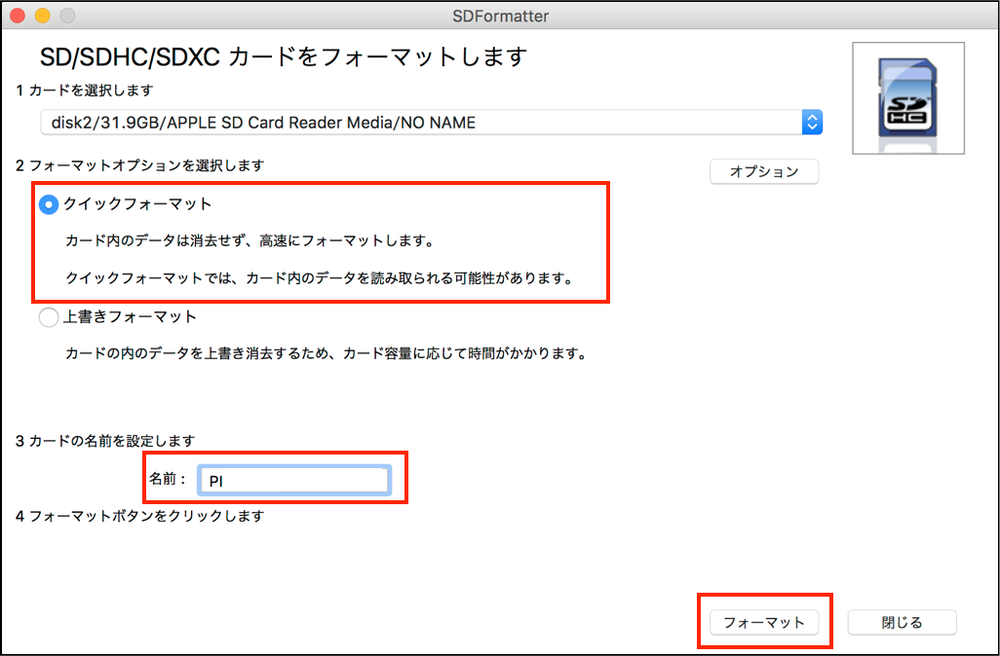
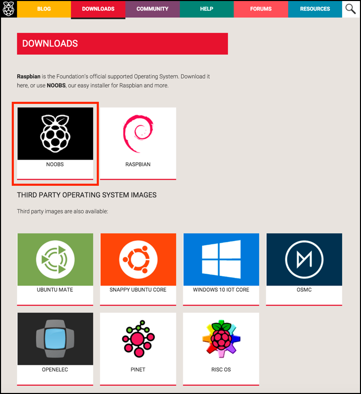
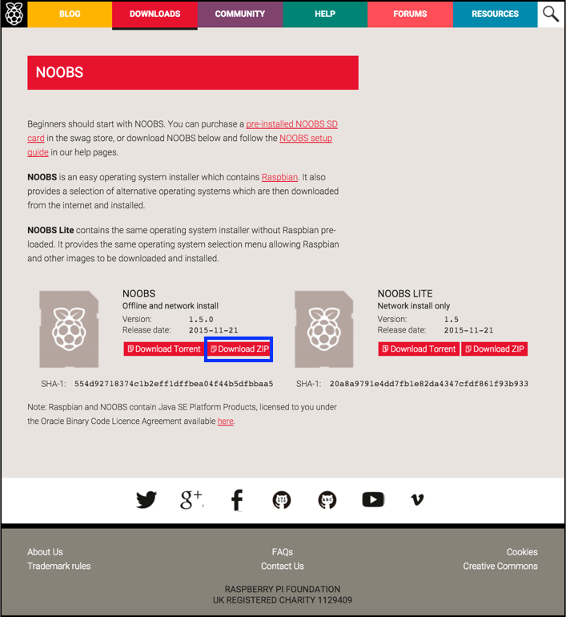
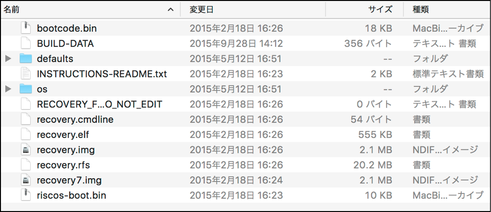
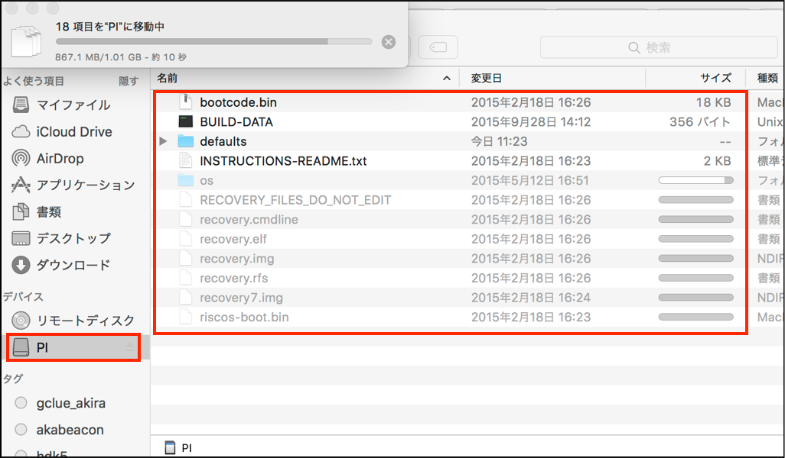

# RASPBIANのインストール

## SD FomatterでSDカードをフォーマット

SD Formatterをダウンロードしインストールする。

https://www.sdcard.org/downloads/formatter_4/

SD FormatterでSD Cardを初期化する。

## NORBSをSDにコピー

https://www.raspberrypi.org/downloads/

ダウンロードして、解凍する。

解凍したファイルをSDカードにまるごとコピーする。

