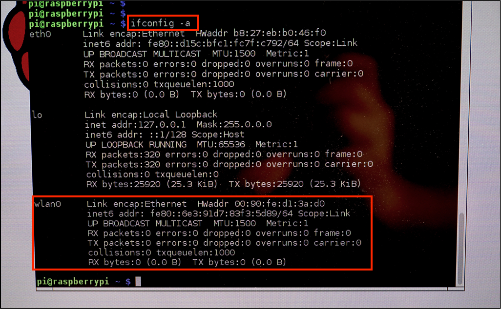
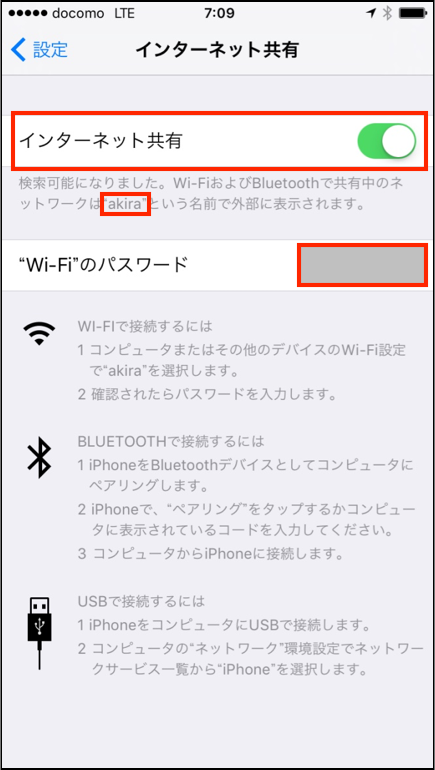
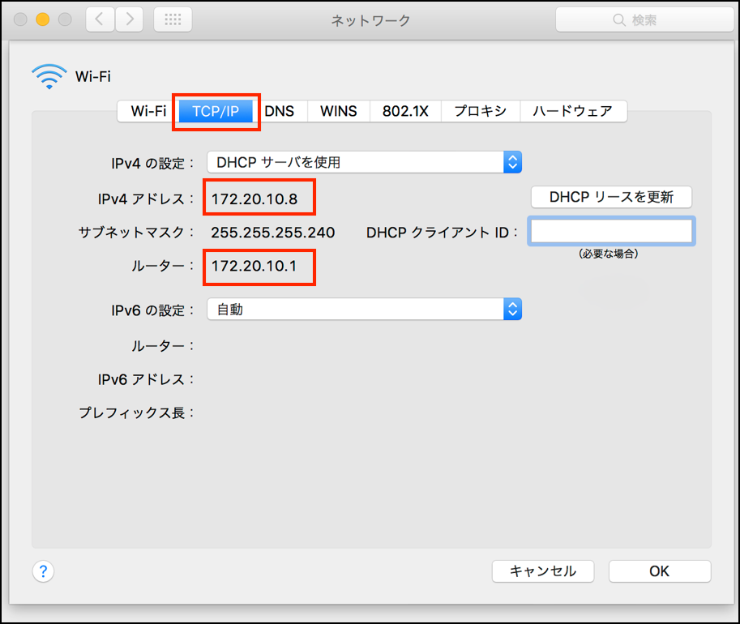

# PIとiPhoneでネットワーク構築

## USB Wifiモジュールの確認(Raspberry PI側)

    $ inconfig -a

wlan0が有効になっていれば、USB Wifi モジュールは認識されている



## iPhoneとティザリングし設定値をメモする



| 項目 | 値 |
| -- | -- |
| ネットワーク名(SSID) | akira |
| パスワード | ######## |




| 項目 | 値 |
| -- | -- |
| IPアドレス | 172.20.10.8 |
| ルーター | 172.20.10.1 |

## SSID, PASSの設定(Raspberry PI側)

iPhoneのティザリングスポットを確認する

    $ sudo iwlist wlan0 scan | grep ネットワーク

suでSuperUserに変わる。

    $ sudo su

pass_pharaseを追加する。    
    
    $ wpa_passphrase 'SSID' 'pass' >> /etc/wpa_supplicaion/wpa_supplicat.conf
 
'SSID'と'pass'には、iPhoneのインターネット共有でメモしたネットワーク名とパスワードをいれる。

`/etc/wpa_supplicant/wpa_supplicant.conf`

```
ctrl_interface=DIR=/var/run/wpa_supplicant GROUP=netdev
update_config=1
network={
	ssid="akira"
	#psk="11111111"
	psk=75d54dab398dcef5bc7fe3be5803f50083c0de5a46955d2c54aa30844d3ba30e
}
```

| 項目 | 値 |
| -- | -- |
| ネットワーク名(SSID) | akira |
| パスワード | ######## |

interfaceの設定を変更する。wlan0の設定をstaticなIPにする。Gatewayには、ルーターのアドレスを記載。　

`/etc/network/interfase`

```
# Please note that this file is written to be used with dhcpcd.
# For static IP, consult /etc/dhcpcd.conf and 'man dhcpcd.conf'.

auto lo
iface lo inet loopback

auto eth0
allow-hotplug eth0
iface eth0 inet manual

auto wlan0
iface wlan0 inet static
address 172.20.10.10
netmask 255.255.255.240
gateway 172.20.10.1
wpa-conf /etc/wpa_supplicant/wpa_supplicant.conf

auto wlan1
allow-hotplug wlan1
iface wlan1 inet dhcp
wpa-conf /etc/wpa_supplicant/wpa_supplicant.conf
``` 

wireless-power off をいれるとSSHがスムーズになる。

ネットワークをリスタートする。

    # /etc/init.d/networking restart
    
# 確認(Raspberry PI側)

```
$ ifconfig -a
eth0      Link encap:Ethernet  HWaddr b8:27:eb:b0:46:f0  
          UP BROADCAST MULTICAST  MTU:1500  Metric:1
          RX packets:0 errors:0 dropped:0 overruns:0 frame:0
          TX packets:0 errors:0 dropped:0 overruns:0 carrier:0
          collisions:0 txqueuelen:1000 
          RX bytes:0 (0.0 B)  TX bytes:0 (0.0 B)

lo        Link encap:Local Loopback  
          inet addr:127.0.0.1  Mask:255.0.0.0
          inet6 addr: ::1/128 Scope:Host
          UP LOOPBACK RUNNING  MTU:65536  Metric:1
          RX packets:324 errors:0 dropped:0 overruns:0 frame:0
          TX packets:324 errors:0 dropped:0 overruns:0 carrier:0
          collisions:0 txqueuelen:0 
          RX bytes:26256 (25.6 KiB)  TX bytes:26256 (25.6 KiB)

wlan0     Link encap:Ethernet  HWaddr 00:90:fe:d1:3a:d0  
          inet addr:172.20.10.10  Bcast:172.20.10.15  Mask:255.255.255.240
          inet6 addr: fe80::290:feff:fed1:3ad0/64 Scope:Link
          UP BROADCAST RUNNING MULTICAST  MTU:1500  Metric:1
          RX packets:243 errors:0 dropped:22 overruns:0 frame:0
          TX packets:172 errors:0 dropped:1 overruns:0 carrier:0
          collisions:0 txqueuelen:1000 
          RX bytes:36889 (36.0 KiB)  TX bytes:33653 (32.8 KiB)
```

```
$ iwconfig
wlan0     IEEE 802.11bgn  ESSID:"akira"  Nickname:"<WIFI@REALTEK>"
          Mode:Managed  Frequency:2.437 GHz  Access Point: F2:33:11:4A:41:D1   
          Bit Rate:72.2 Mb/s   Sensitivity:0/0  
          Retry:off   RTS thr:off   Fragment thr:off
          Power Management:off
          Link Quality=0/100  Signal level=45/100  Noise level=0/100
          Rx invalid nwid:0  Rx invalid crypt:0  Rx invalid frag:0
          Tx excessive retries:0  Invalid misc:0   Missed beacon:0

lo        no wireless extensions.

eth0      no wireless extensions.
```
    
## Macからのログイン

	$ ssh pi@172.20.10.10