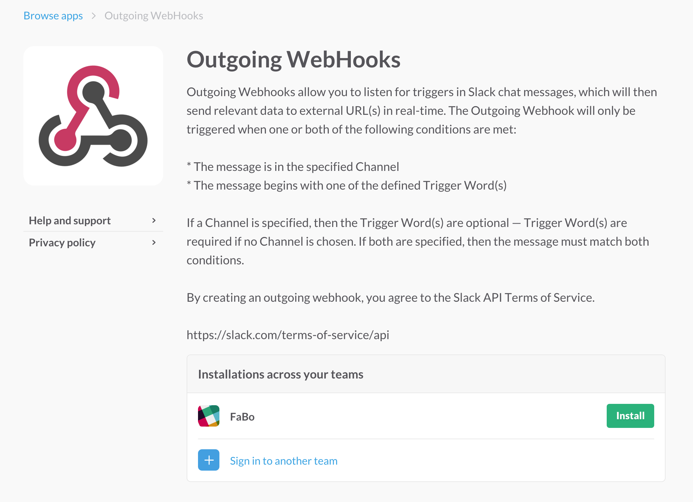

# Incoming Webhooks

一番簡単に外部からメッセージを投稿できる方法。  
HTTPで指定のアドレスにJSONをPOSTする。

## 使い方

* Integrationを追加する。  
  左のチーム名をクリックすると出てくるメニューから「Apps & Custom Integrations」を選択する。
 

* IncommingWebhooksを探してクリックする。
 

* Installボタンをクリックする。
 