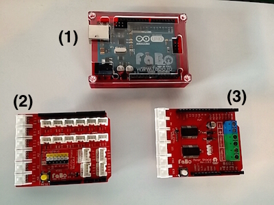
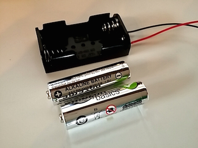
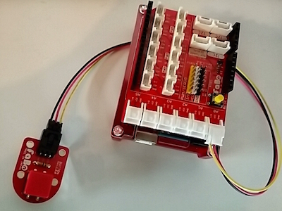
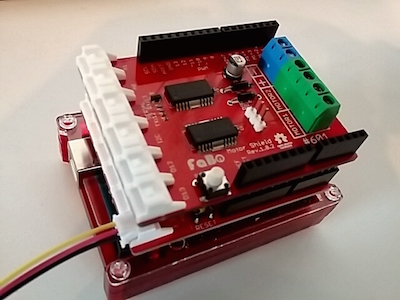
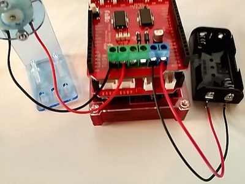

# Propeller Kit

#パーツ構成
・DCモーター１個 
・プロペラ１個 

・アクリルパーツ(1)~(3) ※下イラスト参照

 
・M3-35mmネジ２本、M3ナット２個（鉄） 
・M3-20mmネジ２本、M3ナット２個（プラ)

補足：アクリルパーツ(3)にある楕円形の穴３個は本体固定用の穴です。組立自体には使用しません。

**注意：ネジを必要以上にキツく締めるとアクリルパーツが破損する可能性があります。**

#1.アクリルパーツ(1)と(2)でDCモーターを挟み、ネジで固定します。

(c)にDCモーターのシャフトが出るように固定します。 
(c')の穴にDCモーター後部をはめ込みます。リード線取り付け端子が下になります。 
(a)(b)側からM3-35mmネジを差し込み(a')(b')側でナットを取り付けます。

#2.アクリルパーツ(3)をアクリルパーツ(1)下部に取り付けます。
(d)(e)側からM3-20mmネジを差し込み、M3ナットを約10mmほどスペースをあけて取り付けます。 

スペースをあけたナットを(d')(e')にはめ込むようにアクリルパーツ(3)を(1)と垂直になるように取り付け、ネジを閉めて固定します。 

#3.プロペラを取り付けます
シャフトにプロペラを取り付けます。

#完成イメージ

※クリップは付属していません。   

#Arduinoと繋げる
#パーツ構成
・プロペラキット本体（上記で作成したもの） 
・ArduinoUNO本体１台 
・FaBo Arduino用シールド1枚 
・FaBo Button Brick１枚 
・モーターシールド１枚 

・単三電池２本用電池ボックス 
・単三電池２本 

#1.Arduino本体(1)にFaboシールド(2)を取り付け、シールドにボタンブリックを接続する。
 
※ヘッダーピンが折れないように注意しましょう。

#2.FaBoシールド(2)の上からモーターシールド(3)を取り付ける。
 
※前の手順同様にヘッダーピンが折れないように注意しましょう。

#3.モーターシールド(3)にプロペラキット本体と電池ボックスを取り付ける。
 
プロペラキットをMOTOR1に、電池ボックスを電源（＋ー）に取り付けます。 
電池は動作直前に取り付けます。
電池ボックスの電極は間違えないように!! 故障の原因になります!!
赤がプラスです。 
※プロペラキットは電極が反対でも故障はしませんが風向きが逆になります。

