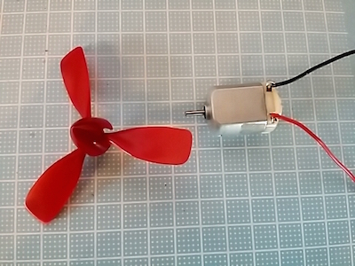
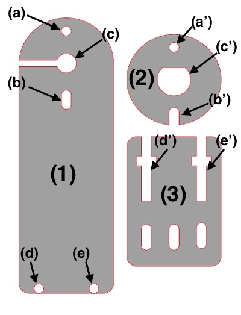
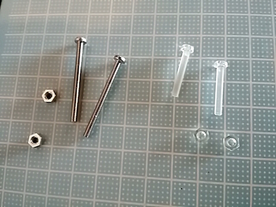
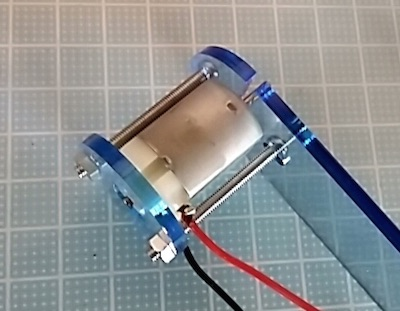
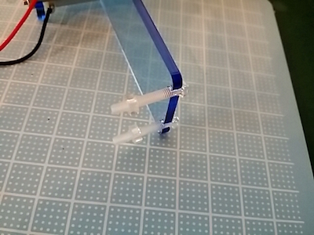
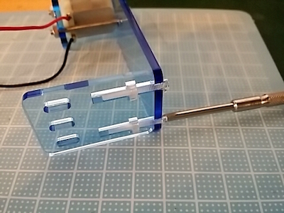
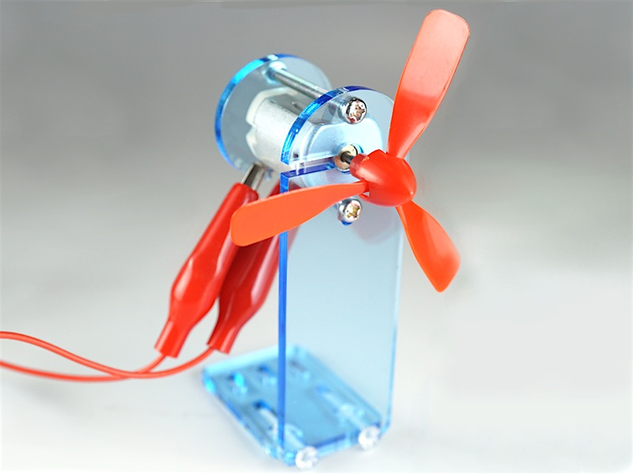

# Propeller Kit

#パーツ構成
・DCモーター１個 
・プロペラ１個 

・アクリルパーツ(1)~(3) ※下イラスト参照

 
・M3-35mmネジ２本、M3ナット２個（鉄） 
・M3-20mmネジ２本、M3ナット２個（プラ)

補足：アクリルパーツ(3)にある楕円形の穴３個は本体固定用の穴です。組立自体には使用しません。

#1.アクリルパーツ(1)と(2)でDCモーターを挟み、ネジで固定します。

(c)にDCモーターのシャフトが出るように固定します。 
(c')の穴にDCモーター後部をはめ込みます。リード線取り付け端子が下になります。 
(a)(b)側からM3-35mmネジを差し込み(a')(b')側でナットを取り付けます。

#2.アクリルパーツ(3)をアクリルパーツ(1)下部に取り付けます。
(d)(e)側からM3-20mmネジを差し込み、M3ナットを約10mmほどスペースをあけて取り付けます。 

スペースをあけたナットを(d')(e')にはめ込むようにアクリルパーツ(3)を(1)と垂直になるように取り付け、ネジを閉めて固定します。 

#3.プロペラを取り付けます
シャフトにプロペラを取り付けます。

#完成イメージ

※クリップは付属していません。

