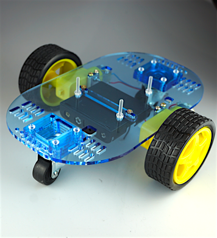

#Robot Car Kit for Arduino

###
Arduino、MoterShield無し

###
Arduino、MoterShield有り

<!--COLORME-->
ロボットカーのキットです。
 
[Motor Shield for Arduino](https://fabo.gitbooks.io/module/content/shield_motor/shield_motor.html)を利用することで、Arduinoから操作できるロボットカーを簡単に作成することができます。

### ロボットカー組み立て
* ロボットカー作成
 
https://sites.google.com/a/gclue.jp/roboka-zuo-cheng/home

### 操作方法
* Motor Shield for Arduino
 
https://fabo.gitbooks.io/module/content/shield_motor/shield_motor.html
