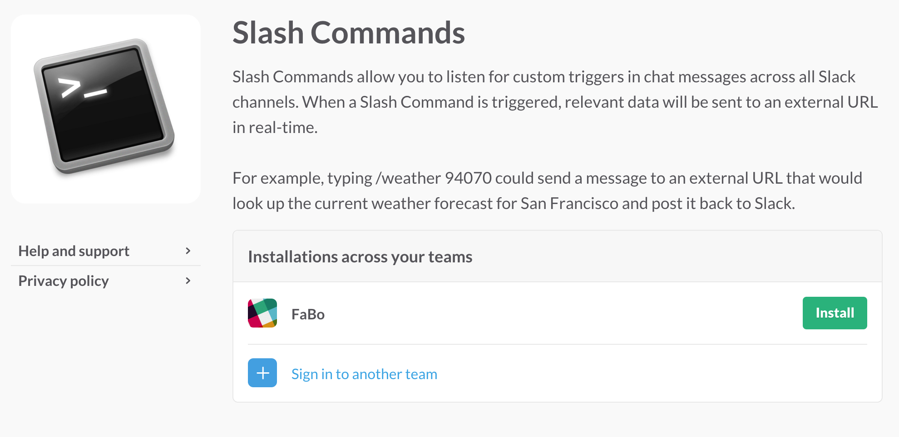

# Slash Commands

/から始まるコマンドを自作できる。  
コマンドが入力されると指定のアドレスにPOSTされる。

## 使い方

1. Integrationを追加する。  
  左のチーム名をクリックすると出てくるメニューから「Apps & Custom Integrations」を選択する。
 

2. Slash Commandsを探してクリックする。
 

3. Installボタンをクリックする。
 