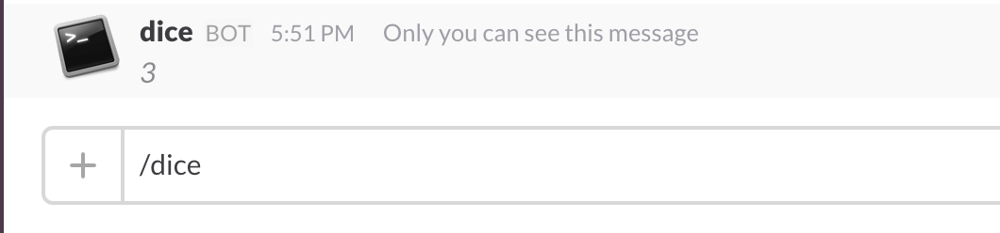

# Slash Commands

/から始まるコマンドを自作できる。  
コマンドが入力されると指定のアドレスにPOSTされる。


## Slackの設定

1. Integrationを追加する。  
  左のチーム名をクリックすると出てくるメニューから「Apps & Custom Integrations」を選択する。
 

2. Slash Commandsを探してクリックする。
 

3. Installボタンをクリックする。
 

4. コマンド名を決める。
 

5. コマンド実行の通知先URLを設定する。
 


## サーバー作成

コマンドが実行されると設定したURLが呼ばれるので、レスポンスを返すと内容が表示される。  
以下node.jsで"/dice"コマンド（1~6までの乱数を返す）を作成した例。

 ```
var express = require('express');
var app = express();
var port = process.env.PORT || 3000;

function randomInt (low, high) {
    return Math.floor(Math.random() * (high - low) + low);
}

// ただ1-6の乱数を返すだけ
app.post('/', function(req, res) {
  res.json({
    text: String(randomInt(1, 6))
  });
});

app.listen(port, function(){
  console.log('listening on port %d!', port);
});
 ```

* 実行結果 
 

